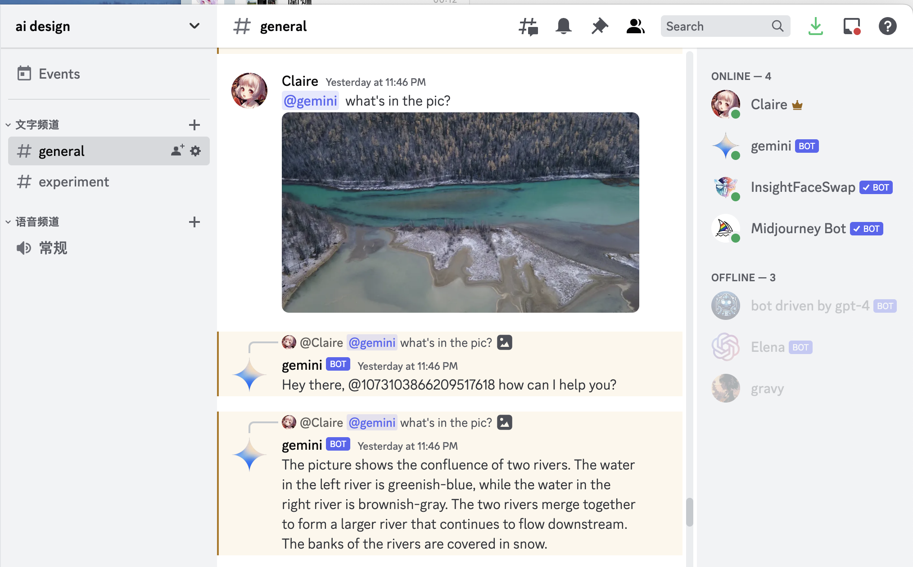
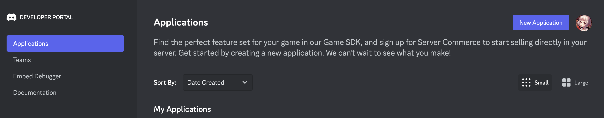
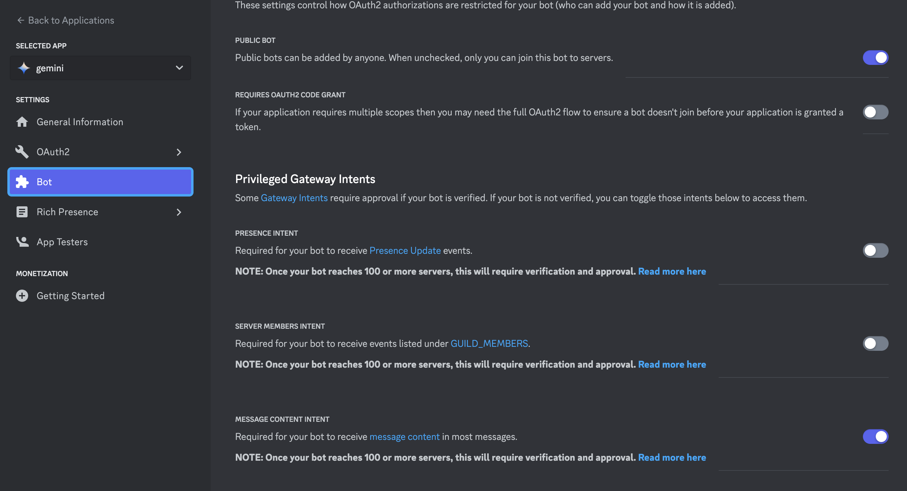
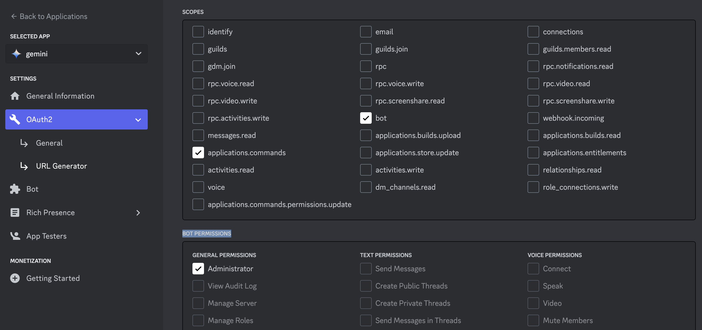

# Discord Bot with Gemini

This project is a Discord bot that integrates with the Gemini API. It allows authorized users to interact with the Gemini API through specific channels in Discord.
you can get a bot like below:

## Prerequisites

- Node.js
- npm
- Docker (optional)
- discord account

## creare a discord bot

1.Have a discord account and visit [discord api platform] (https://discord.com/developers/applications)
2.New application, specify its basic information.
3.switch to bot and enable PUBLIC BOT and MESSAGE CONTENT INTENT. 
4.direct to Oauth2-URL generator, enable bot and applications.commands in scopes, then chose adminstrator in BOT PERMISSIONS to generate invite link, copy the link below, and open in a new tab, you can invite the bot in your own discord server. 

## Setup

1. Clone the repository to your local machine.
2. Navigate to the project directory.
3. Install the dependencies by running `npm install`.
4. Copy the `.env.example` file to a new file named `.env`.
5. Replace `your_token` and `your_api_key` in the `.env` file with your Discord token and Gemini API key, respectively.
6. Replace the user and channel IDs in `AUTHORIZED_USERS` and `AUTHORIZED_CHANNELS` with the IDs of the users and channels that you want to authorize.

## Usage

Start the bot by running `npm start`. The bot will then be active in the authorized channels.

## Deployment

If you want to deploy the bot using Docker, you can build a Docker image and run a container using the provided Dockerfile.

1. Build the Docker image by running `docker build -t discord_bot .`.
2. Run a Docker container from the image by running `docker run -d discord_bot`.

Please note that the bot needs to be able to access the Discord and Gemini APIs, so make sure your deployment environment allows outbound network connections.

## Contributing

Contributions are welcome. Please submit a pull request if you have something to add or fix.

## License

This project is licensed under the ISC license.
